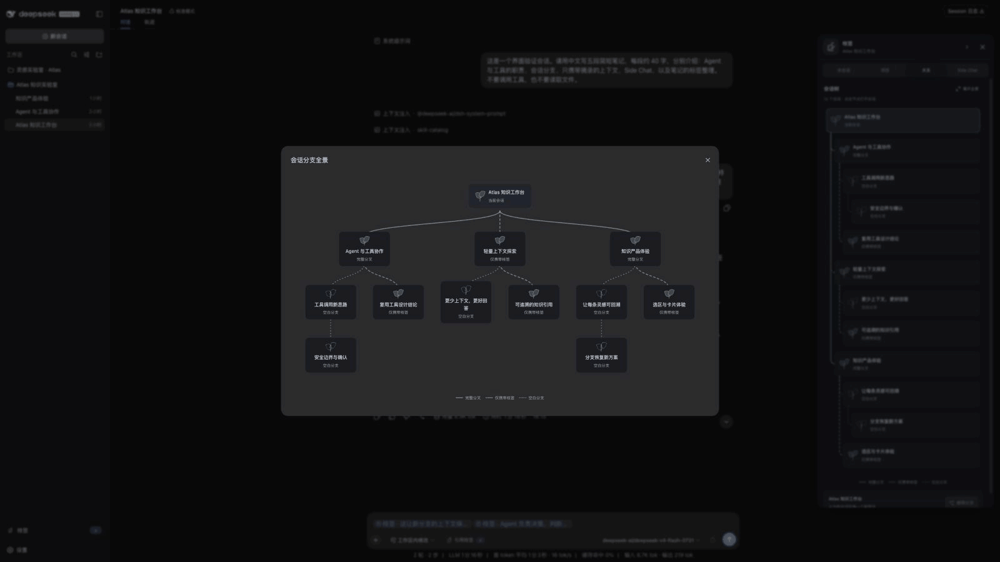
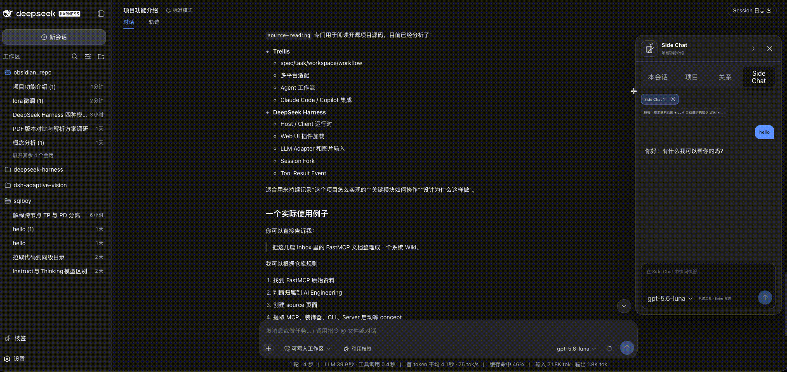

<p align="center">
  
</p>

<h1 align="center">枝签 · BranchMark</h1>

<p align="center"><strong>摘一段，生一枝。</strong></p>

<p align="center">为开发者提供重点知识摘录、可追溯 Session 树和注意力分叉，让主 Session 始终专注于当前目标，让每条支线都能找回来源，让 Vibe Coding 告别注意力丢失。</p>

<p align="center">
  <a href="README.en.md">English</a> ·
  <a href="#交互演示">交互演示</a> ·
  <a href="#branchmark-解决的是开发者的注意力丢失">为什么需要</a> ·
  <a href="#session-树与会话管理">Session 树</a> ·
  <a href="#快速开始">快速开始</a> ·
  <a href="#dsh-插件发布与生态要求">发布要求</a>
</p>

<p align="center">
  <a href="https://www.npmjs.com/package/dsh-branchmark"></a>
  <a href="https://www.npmjs.com/package/dsh-branchmark?activeTab=versions"></a>
  
  
  <a href="LICENSE"></a>
</p>

## 交互演示

左侧展示从重点摘录创建正式 Session、切换会话并沿 Session 树追溯来源；右侧展示不打断主线的临时 Side Chat，以及把值得保留的内容重新摘录为枝签。点击任一动图可以查看原尺寸。

<table>
  <thead>
    <tr>
      <th width="50%">枝签、正式分叉与 Session 树</th>
      <th width="50%">临时 Side Chat 与再摘录</th>
    </tr>
  </thead>
  <tbody>
    <tr>
      <td width="50%" valign="top"><a href="assets/demo/branchmark-session-tree-and-derived-session-demo.gif"></a></td>
      <td width="50%" valign="top"><a href="assets/demo/branchmark-side-chat-and-clipping-demo.gif"></a></td>
    </tr>
  </tbody>
</table>

> [!IMPORTANT]
> 当前源码面向 DSH npm `latest` 的 `0.1.2-rc.1`，BranchMark 的目标包版本同为 `0.1.2-rc.1`。发布前可从源码构建 tarball 安装；不要假设两个包的 `latest` 标签已同步。旧的 `0.1.1-rc.2` 组合与 `0.1.2-alpha.5` 组合继续使用精确版本，不能交叉安装。

BranchMark 是一个不修改 DSH 源码的插件 Bundle。它把会话消息中的关键片段保存为“枝签”，再以枝签所在消息为注意力分叉点，创建继承原上下文的子 Session，或只携带重点知识的独立 Session。枝签原文与来源锚点保持不可变，备注和标签可以编辑。

## 目录

- [交互演示](#交互演示)
- [BranchMark 解决的是开发者的注意力丢失](#branchmark-解决的是开发者的注意力丢失)
- [核心工作流：摘录、分叉、回到主线](#核心工作流摘录分叉回到主线)
- [Session 树与会话管理](#session-树与会话管理)
- [快速开始](#快速开始)
- [操作速查](#操作速查)
- [数据与权限](#数据与权限)
- [DSH 插件发布与生态要求](#dsh-插件发布与生态要求)
- [文档](#文档)
- [开发与贡献](#开发与贡献)

## BranchMark 解决的是开发者的注意力丢失

长时间开发不是一次连续的问答。你会在实现主任务时遇到值得保存的结论、需要验证的假设和可以并行推进的支线。如果所有追问都留在一个 Session，主线会逐渐被旁支淹没；如果直接创建空白 Session，新会话又不知道问题从何而来；如果只复制文字，知识与产生它的决策过程会断开。

| 开发中的时刻 | 常见处理方式 | 容易丢失的东西 |
| --- | --- | --- |
| 一段回答很重要，但当前还要继续主任务 | 先记在脑中，稍后再找 | 重点知识和来源位置 |
| 一个想法值得深入验证 | 继续在主 Session 追问 | 当前任务的注意力主线 |
| 直接打开新 Session | 重新解释一遍背景 | 父会话上下文和分叉原因 |
| 同时推进多个方向 | 创建多个无关联会话 | Session 之间的父子关系和回到主线的路径 |

BranchMark 将“知识锚点”和“会话分叉”绑定在一起：枝签保存值得复用的内容，Session 关系保存注意力从哪里分开。开发者可以沿主线继续工作，把支线交给新的 Session，并通过关系树或来源入口随时回到原位置。

## 核心工作流：摘录、分叉、回到主线

BranchMark 的核心对象不是额外的聊天窗口，而是从重点知识生长出来的可追溯 Session。

```text
主 Session：继续当前开发目标
        │
        ├── 选择关键文字 → 保存枝签 → 添加备注与标签
        │                              │
        │                              ├── 引用到当前 Composer：留在主线
        │                              ├── 完整分叉：带父会话历史进入子 Session
        │                              └── 仅携带枝签：用重点知识开启独立 Session
        │
        └── 主 Session 不需要承载每一次发散探索
```

### 1. 摘录重点知识

在一条已完成的用户或助手消息中选择文字，然后保存到本会话或当前项目。会话枝签默认只属于来源 Session；项目枝签可以跨 Session 搜索和复用，但只有显式选择“摘录到项目”才会进入项目枝签库。当前 Session 不会看到其他 Session 的私有枝签。

枝签正文和来源消息不可编辑，确保以后引用的仍是当时真正得到的结论。备注和多标签可以编辑，用来记录“为什么重要”“下一步要验证什么”以及它属于哪个技术主题。

### 2. 从知识点分叉注意力

创建新 Session 时，先决定新任务需要多少父会话背景：

| 分叉方式 | 新 Session 获得什么 | 注意力策略 |
| --- | --- | --- |
| 完整分叉 | 主要枝签的来源 Session 从开头到来源消息完整轮次的历史，以及全部所选枝签和备注 | 带着原推理过程继续深入 |
| 仅携带枝签 | 一个没有 DSH parent 的全新 Session，以及全部所选枝签和备注 | 只带重点知识，隔离父会话噪声 |

多枚枝签来自不同 Session 时，你需要选择一个主要来源。主要来源只决定完整分叉继承哪条父会话链；其余枝签仍作为完整知识材料进入新 Session。

### 3. 推进支线，再回到来源

“创建并打开”会立即进入新 Session，并保持 Composer 空白；“创建并发送”会先收集问题，再在后台创建和运行新 Session。衍生 Session 显示来源入口和分叉信息，枝签卡片也会列出使用它的衍生 Session。

新 Session 创建后拥有独立生命周期。回收或永久删除枝签不会删除、重写或中止已经创建的衍生 Session。

### 快问快答

Side Chat 是注意力管理中的临时出口，不是 BranchMark 的主数据结构。它适合围绕一枚或多枚枝签快速提问，不向来源 Session 写入消息，也不进入 Session 树；关闭标签或退出 Host 后立即销毁。值得保留的结果可以再保存为枝签或转成正式 Session。

## Session 树与会话管理

完整分叉直接使用 DSH 原生 Session fork。DSH `parentSession` 是父子关系的权威来源，BranchMark 的“关系”视图通过 `parentId` 投影当前 Session 所在的已知树。

```text
Session A：实现认证主流程
├── Session B：从“权限模型”完整分叉
│   └── Session D：从“缓存失效”再次完整分叉
└── Session C：从“数据库迁移”完整分叉

Session E：仅携带枝签创建
└── 没有 DSH parent；通过 BranchMark 枝签使用关系连接来源知识
```

BranchMark 保留两种关系，并且不把它们混为一棵伪造的树：

| 关系 | 权威数据 | 在界面中的作用 |
| --- | --- | --- |
| DSH Session lineage | `SessionHeader.parentSession` / Client `parentId` | 构成完整分叉的父子 Session 树 |
| BranchMark 使用关系 | 衍生 Session、主要枝签、附加枝签和不可变使用快照 | 从枝签找到衍生 Session，从衍生 Session 跳回来源 |
| Side Chat | 无持久关系 | 只作为临时快问快答标签 |

这种区分让会话管理保持真实：完整分叉表达“这个 Session 从父会话的某个完成轮次继续”；仅枝签表达“这个独立 Session 使用过这些知识”。两者都可追溯，但只有前者进入 DSH Session 树。

## 快速开始

BranchMark 通过 npm Bundle 安装到 DSH Web Profile。保存枝签、查看关系树和“创建并打开”不需要模型；向正式 Session 发送问题或使用 Side Chat 时，仍需要在 DSH 中配置可用模型。

### 要求

| npm 通道 | BranchMark | DeepSeek Harness | 用途 |
| --- | --- | --- | --- |
| 当前源码 / 目标 `latest` | `0.1.2-rc.1` | `0.1.2-rc.1` | npm 发布前使用下方源码 tarball 安装 |
| `alpha` | `0.1.2-alpha.5` | `0.1.2-alpha.5` | 已发布的 alpha 兼容线 |
| 旧版固定组合 | `0.1.1-rc.2` | `0.1.1-rc.2` | `release/dsh-0.1.1-rc` 维护线 |

所有组合都要求 Node.js `^22.19.0` 或 `>=24.0.0`，并且只支持 DSH Web Profile。BranchMark 版本必须和 `dsh --version` 完全一致。

先用 `npm view @deepseek-ai/dsh dist-tags` 与 `npm view dsh-branchmark dist-tags` 核对通道；安装使用上表中的精确版本。目标 BranchMark 版本尚未发布时，使用下方源码 tarball 安装，不要用旧版 `latest` 替代。

### 1. 选择并安装同号版本

安装当前源码对应的版本（需先确认 `dsh-branchmark@0.1.2-rc.1` 已发布）：

```sh
npm install --global @deepseek-ai/dsh@0.1.2-rc.1
dsh plugin --profile web add dsh-branchmark@0.1.2-rc.1
```

使用已发布的 `alpha` 组合：

```sh
npm install --global @deepseek-ai/dsh@0.1.2-alpha.5
dsh plugin --profile web add dsh-branchmark@0.1.2-alpha.5
```

如果需要与日常 Profile 隔离，可以在安装前创建专用 DSH home：

```sh
export BRANCHMARK_DSH_HOME="$(mktemp -d)"
DSH_HOME="$BRANCHMARK_DSH_HOME" \
  dsh plugin --profile web add dsh-branchmark@0.1.2-alpha.5
```

采用隔离 home 时，后续每条 `dsh` 命令也必须带上 `DSH_HOME="$BRANCHMARK_DSH_HOME"`；否则命令会读取默认 Profile。

### 2. 验证 Profile

```sh
dsh --version
dsh --profile web --dump-config
```

`dsh --version` 必须与安装的 BranchMark 版本相同；配置输出中应出现 `dsh-branchmark` 和 `branchmark-host`。版本不同或缺少这两个条目时，先删除错误版本，再按同一通道重新安装。

### 3. 从目标项目启动 DSH

DSH 默认把启动命令所在目录作为 Workspace，因此先进入你真正要处理的项目：

```sh
cd /absolute/path/to/your/project

dsh web
```

打开一个 Session，等待一条用户或助手消息完成，然后选择其中的文字。看到四项选区操作和右侧枝签浮签，即表示插件已经加载。

### 从源码构建当前 alpha

```sh
git clone https://github.com/zaizaizhao/dsh-branchmark.git
cd dsh-branchmark
corepack enable
pnpm install --frozen-lockfile
pnpm run release:check
pnpm run pack:bundle
dsh plugin --profile web add ./dist/dsh-branchmark-0.1.2-rc.1.tgz
```

不要通过 Git URL、GitHub source specifier 或 `plugin add .` 安装。源码仓库不提交构建后的 `lib/`；npm 包和本地构建的 tarball 才是完整安装介质。

## 操作速查

所有入口都要求用户显式选择或发送。BranchMark 不会因为选中文字就自动向模型发起请求。

| 你的注意力需求 | 使用的操作 | 结果 |
| --- | --- | --- |
| 记住当前任务中的关键结论 | 摘录到会话 | 枝签持久化，只在来源 Session 显示 |
| 把重点知识提供给其他 Session | 摘录到项目 | 枝签持久化，在当前 Workspace 的项目库显示 |
| 保留当前主线，继续组织问题 | 引用到输入框 | 插入可移除的原生引用 Chip，绝不自动发送 |
| 沿原讨论位置展开正式支线 | 完整分叉 | 创建有 DSH parent 的持久化子 Session |
| 用重点知识开始隔离任务 | 仅携带枝签 | 创建无 DSH parent 的持久化根 Session |
| 管理并行开发支线 | 关系视图与枝签卡片 | 查看 Session 树、来源和双向使用关系 |
| 临时确认一个小问题 | Ask in side | 创建不入树、不持久化的快问快答标签 |

右侧枝签浮签默认位于中线上方，避开 DSH 居中的轮次导航。按住浮签可沿右侧边缘上下拖动，松手不会误打开面板；位置在本浏览器中保存，窗口缩放后仍限制在可见范围内。单击展开，键盘聚焦后可用 ↑/↓ 微调、Home/End 移至上下边缘。

右侧 Dock 提供“本会话”“项目”“关系”和“Side Chat”视图。项目枝签库支持全文搜索、多标签筛选、卡片/列表切换、置顶、同组排序、多选操作和回收站。

## 数据与权限

BranchMark 把长期知识与关系留在 DSH 本地，把临时探索限制在当前 Host 进程中。

- 枝签、备注、标签、排序、回收站、使用快照和衍生关系写入 DSH 本地 `storageDomain` 的 `clip_explorer` domain；插件不提供云同步，也不向作者控制的服务上传数据。
- 完整分叉和仅枝签 Session 都使用 DSH 原生持久化；BranchMark 不复制或替代 DSH Session 日志。
- 保存、搜索、组织枝签和查看关系不调用模型。只有用户发送问题后，所选枝签、启用的备注和恢复出的上下文才会进入当前 DSH provider 的请求。
- Side Chat 的项目文件工具只读，但工具结果可能进入模型请求；Web 搜索和抓取遵循当前 DSH 部署的 provider 配置。
- Workspace 和 Session 是当前的数据隔离键；Worktree 不是独立隔离边界。BranchMark 只支持 DSH Web Profile，也不会改变 DSH 原生侧边栏的会话层级。

完整配置、网络行为和限制见 [Bundle 使用参考](packages/bundle/README.md) 与 [兼容性和限制](course/reference/compatibility-and-limitations.md)。安全问题请按 [SECURITY.md](SECURITY.md) 私下报告，不要在公开 issue、日志或截图中提交凭据。

## DSH 插件发布与生态要求

BranchMark 按目标版本 DSH 的官方 Bundle 机制分发。DSH 的[插件打包与安装文档](https://github.com/deepseek-ai/deepseek-harness/blob/db6bdc3576c2d4e7c965e8e3ed0c2a731eed87f5/docs/user/develop/basic/publish.md)定义 Profile Bundle，[Client module 文档](https://github.com/deepseek-ai/deepseek-harness/blob/db6bdc3576c2d4e7c965e8e3ed0c2a731eed87f5/packages/client/modules/README.md)定义 Web 浏览器入口。

在 BranchMark 支持的 DSH 版本中，官方资料没有提供第三方插件市场提交接口，官方仓库也暂不接受外部代码 PR。DSH 的[贡献说明](https://github.com/deepseek-ai/deepseek-harness/blob/db6bdc3576c2d4e7c965e8e3ed0c2a731eed87f5/CONTRIBUTING.md)建议作者在自己的仓库维护插件，并添加 GitHub [`dsh-plugin`](https://github.com/topics/dsh-plugin) topic 供生态发现。社区目录可以作为额外分发渠道，但不代表 DSH 官方审核、兼容性保证或安全认证。

<details>
<summary>查看可安装条件与 BranchMark 发布准备状态</summary>

### 可安装 Bundle 的技术条件

| DSH 条件 | BranchMark 的实现 |
| --- | --- |
| 包必须有非空 `name` 和 `version`，并提供可解析的运行入口 | `dsh-branchmark@0.1.2-rc.1` 交付预编译 Host、Typert、Remote 和浏览器入口 |
| `package.json` 必须声明 `dsh.bundle.patch`，否则 `dsh plugin add` 只安装普通依赖，不激活 Profile 层 | `packages/bundle/package.json` 指向 `./cordis.patch.yml` |
| `cordis.patch.yml` 必须插入或覆盖实际 Loader 行，并使用安装后可解析的包名 | Bundle patch 插入 `branchmark-host`，模块名为 `dsh-branchmark` |
| Web 插件必须导出 `./client`，并以 `dsh.client.platform: "web"` 声明浏览器入口 | Bundle 导出自包含 `lib/client.js`，并声明所需 Client 注入项 |
| npm 包或 tarball 必须包含编译产物；Git 源码安装若需要构建，必须提供自包含 `prepare`，并由用户在 pnpm 中显式授权 | BranchMark 不执行安装期脚本，只支持包含 `lib/` 的本地 tarball；当前禁止 Git 源码直装 |
| 安装后应通过 `--dump-config` 验证 Bundle 层，再重启目标 Profile | README 和发布流程都在隔离 `DSH_HOME` 中检查 `dsh-branchmark` 与 `branchmark-host` |

BranchMark 当前的发布准备状态：

| 项目 | 状态 |
| --- | --- |
| 独立公开仓库、MIT License、Issues 与安全报告入口 | 已具备 |
| `dsh.bundle.patch`、`cordis.patch.yml`、Web `./client` 与 `dsh.client` 声明 | 已具备 |
| Node `22.19` / `24` CI、keyless 测试、Bundle 自包含检查和 npm dry-run | 已具备 |
| 独立 Profile tarball 安装与 `--dump-config` 验证 | 已具备 |
| npm `latest` 与 `alpha` 同号发布 | 已完成 |
| GitHub `dsh-plugin` topic | 已完成 |

</details>

正式发布步骤、文件清单、npm 校验和真实 Profile smoke test 见 [RELEASING.md](RELEASING.md)。

## 文档

README 负责解释注意力问题、Session 管理、安装路径和发布状态。完整产品规则、实现原理和复现课程分别由下面的文档维护。

| 你想了解 | 文档 |
| --- | --- |
| 从基础到复现整个插件 | [课程入口](course/README.md) |
| 产品规则与验收范围 | [PRD](docs/PRD.md) |
| Host、Client、存储、Session 分叉与关系架构 | [架构说明](docs/ARCHITECTURE.md) |
| DSH Session lineage 与 BranchMark 使用关系 | [架构地图](course/reference/architecture-map.md) |
| DSH Client 为什么采用当前扩展设计 | [DSH Client 架构取舍](course/reference/dsh-client-architecture-rationale.md) |
| 配置字段、数据规则和限制 | [Bundle 使用参考](packages/bundle/README.md) |
| 发布与真实 Profile 验收 | [发布流程](RELEASING.md) |

## 开发与贡献

提交代码前运行：

```sh
pnpm run check
pnpm run release:check
```

`check` 覆盖类型检查、keyless 测试、构建和 Bundle 自包含检查；`release:check` 继续检查文档、公开包元数据、publint 和 npm dry-run。真实 provider 请求不进入 keyless 检查，发布候选仍需按 [RELEASING.md](RELEASING.md) 在独立 Web Profile 中完成 smoke test。

参与开发请阅读 [CONTRIBUTING.md](CONTRIBUTING.md)。普通缺陷和功能建议提交到 [GitHub Issues](https://github.com/zaizaizhao/dsh-branchmark/issues)；版本变化记录在 [CHANGELOG.md](CHANGELOG.md)。BranchMark 使用 [MIT License](LICENSE)。
