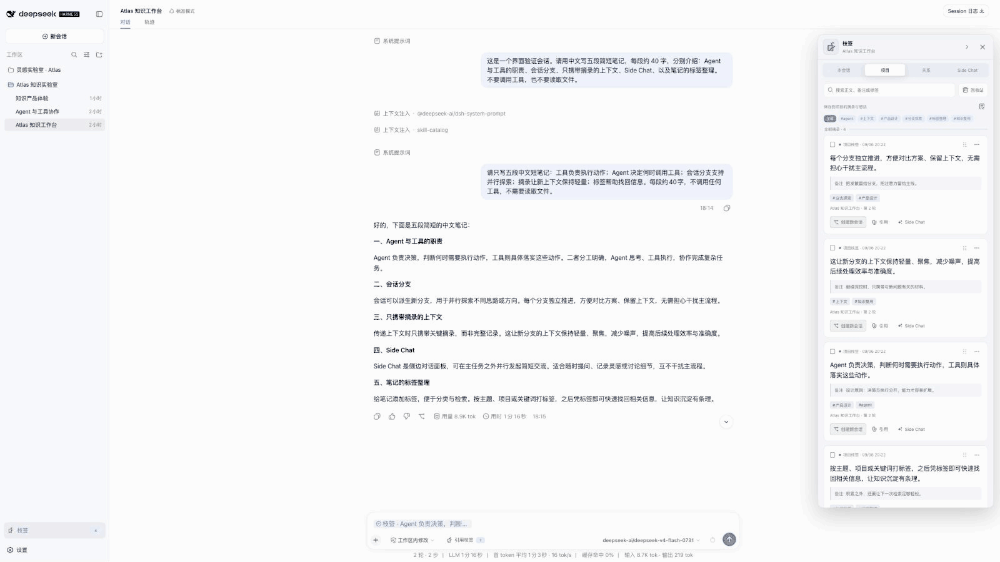

<p align="center">
  
</p>

<h1 align="center">枝签 · BranchMark</h1>

<p align="center"><strong>摘一段，生一枝。</strong></p>

<p align="center">
  <a href="README.en.md">English</a> ·
  <a href="#交互演示">交互演示</a> ·
  <a href="#快速开始">安装与使用</a>
</p>

BranchMark 是一个 DSH Web 插件：保存值得保留的回答，在 Side Chat 中快速追问，再围绕摘录创建相关会话，用会话树管理不同方案。

## 开发心路

最近在公司开发，时间紧、任务多，我经常按想法和功能多开几个 Session。有多个方案时，还会 fork 出新的会话。时间一长，注意力被分散，也容易忘记哪些方案还没审核、各个分支从哪里开始。

> 人脑才是瓶颈啊。

所以做了枝签，把需要记住的内容和需要跟进的会话整理到一起：

- **先记下好想法。** 看到有价值的回答，但暂时不想展开，就先保存为枝签，按需要补充备注和标签。
- **分开跟进多个方案。** 从摘录创建相关会话，在会话树中查看关系，点击节点就能回到对应讨论。
- **随手问清小问题。** 对某段内容不了解，直接打开 Side Chat 快问快答；关闭后销毁临时对话，不留下新的正式会话。

## 交互演示

**保存、整理与引用枝签**

<p align="center">
  <a href="assets/demo/branchmark-clips-and-organization-demo.gif"></a>
</p>

**从摘录继续讨论，在会话树中回顾方案**

<p align="center">
  <a href="assets/demo/branchmark-session-tree-and-derived-session-demo.gif"></a>
</p>

## 快速开始

当前兼容组合为 **BranchMark `0.1.2-rc.2` + DSH `0.1.2-rc.1`**，仅支持 Web Profile。Node.js 要求 `^22.19.0 || >=24.0.0`。

```sh
npm install --global @deepseek-ai/dsh@0.1.2-rc.1
dsh plugin --profile web add dsh-branchmark@0.1.2-rc.2
dsh --profile web
```

已安装对应 DSH 的用户，只需执行插件安装命令，再重启 Web Profile。Side Chat 和正式会话提问需要在 DSH 中配置可用模型。

### 怎么用

1. 在已完成的对话消息中选择文字，保存到本会话或项目。项目枝签可在同一工作区的其他会话中复用。
2. 打开右侧枝签面板，添加备注、标签，或搜索已经保存的内容。
3. 点击 **引用**，将枝签放入输入框；点击 **Side Chat**，围绕它临时追问。引用不会自动发送。
4. 点击 **创建新会话**：完整分叉继承来源历史并携带所选枝签；仅携带枝签只带选中的摘录和启用的备注；空白分支不带历史或摘录，但保留组织关系。
5. 在 **关系** 页查看会话树，点击节点继续对应讨论。

枝签与关系保存在本地；发送问题时，所选内容会交给你配置的模型服务。

卸载插件：

```sh
dsh plugin --profile web remove dsh-branchmark
```

卸载后重启 Web Profile；已有枝签数据会保留。

详细配置见 [Bundle 使用说明](packages/bundle/README.md)，源码构建与安装见 [安装教程](course/tutorials/10-package-install-and-adapt.md)，问题反馈请提交 [GitHub Issue](https://github.com/zaizaizhao/dsh-branchmark/issues)。本项目使用 [MIT License](LICENSE)。

## 社区

[LINUX DO](https://linux.do/) — 真诚、友善、团结、专业的技术交流社区。
